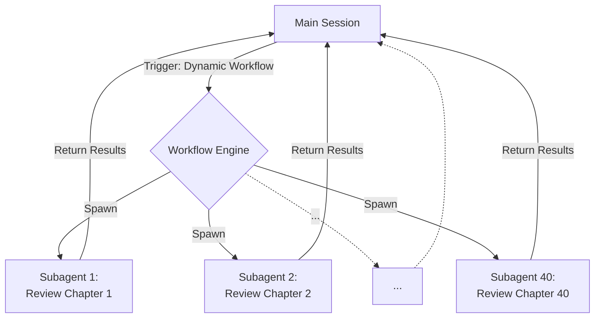

# Dynamic Workflows

## Summary
Dynamic Workflows เป็นฟีเจอร์ระดับสูงใน Claude Code ที่ยอมให้ Main Session สามารถเรียกสร้างและส่งต่องานไปยัง [[Claude Subagent|Subagents]] จำนวนหลายสิบตัวได้ในคราวเดียวกัน (Parallel Execution) โดยอัตโนมัติ 

## Core Content
- **วิธีการทำงาน:**
  - เมื่องานมีขนาดใหญ่และต้องแยกทำคู่ขนาน (เช่น โปรเจคที่มีหลายไฟล์หรือหลายบท) แทนที่จะเรียก Subagent ทีละตัว คุณสามารถสั่งงานให้เป็น Dynamic Workflow ได้
  - ตัวอย่างเช่น การให้ Claude แตก Subagent ย่อยออกไปถึง 40 ตัวเพื่ออ่านและตรวจสอบเนื้อหาพร้อมกัน
  - Trigger word แต่เดิมเคยใช้คำว่า "workflow" ปัจจุบันถูกปรับเป็น "ultra code" (แต่ถ้าพูดถึงตรงๆ ก็ยังใช้ได้)
  
- **ข้อควรระวัง (Warnings):**
  - **Session Limits & Cost:** การรัน Subagents จำนวนมากพร้อมกัน (บางเคสอาจสูงถึง 210 ตัว) จะเผาผลาญ Context Limit และงบประมาณอย่างรวดเร็วมาก
  - จึงควรใช้อย่างระมัดระวังและคำนวณความจำเป็นเสมอ รวมถึงพิจารณาตั้งค่า [[Read-Only Subagents and Cost Efficiency|Cost Efficiency]] ให้กับ Subagent เหล่านั้นก่อน

## Content Visualization

### Parallel Scaling Diagram

## Related
- [[Claude Subagent]]
- [[When to Use a Subagent]]

## Sources
- [[How to Build Claude Subagents Better Than 99% of People]]
