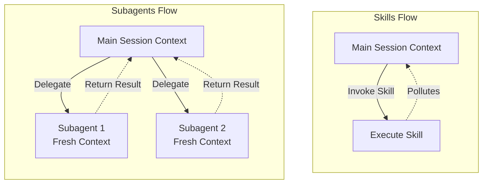

# Skills vs Subagents

## Summary
ทักษะ (Skills) และตัวแทนย่อย ([[Claude Subagent|Subagents]]) ใน Claude Code นั้นมีความคล้ายคลึงกันที่แก่นแท้ โดยเป็นการสร้างกฎการทำงานหรือ Prompt ที่เฉพาะเจาะจง แต่มีความแตกต่างหลักคือเรื่องของ Context Window, การทำงานคู่ขนาน, และการกำหนดโมเดล 

## Core Content
- **ความเหมือน:**
  - ทั้งสองอย่างสร้างด้วยไฟล์ Markdown (`.md`) ที่มี YAML front matter เหมือนกัน
  - เป็นการกำหนดให้ Claude Code ทำงานเป็นลำดับขั้นตอน (Do X, Y, and Z in this order) หรือกำหนด Persona แบบเฉพาะเจาะจง
  
- **ความแตกต่างหลัก:**
  - **Context Window:** การทำงานผ่าน Skill จะเกิดขึ้นใน Main Session และ Context หลักจะถูกใช้งาน (รวมถึงอาจเกิดขยะข้อมูลใน Context) แต่ Subagent จะทำงานใน session แยกที่มี Context สะอาด (Clean Context Window) ใหม่ทั้งหมด
  - **การทำงานคู่ขนาน (Parallel Execution):** Subagents หลายตัวสามารถทำงานพร้อมกันใน session แยกต่างหากได้ แต่ Skill มักจะเป็นการเรียกใช้งานลำดับต่อๆ ไปใน Main Session
  - **Models:** Subagents สามารถถูกกำหนดให้ใช้ Model ราคาถูกกว่า (เช่น Haiku หรือ Sonnet) แยกจาก Main Session ที่ใช้ Opus ได้ 

- **การทำงานร่วมกัน:**
  - Skill และ Subagent ไม่ใช่คู่แข่งกัน แต่สามารถทำงานร่วมกันได้อย่างลงตัว ตัวอย่างเช่น "Skill" สามารถเรียกใช้งาน "Subagent" ได้ และในทางกลับกัน "Subagent" ก็สามารถนำ "Skill" ที่เราสร้างไว้ไปใช้ใน session ของมันเองได้

## Content Visualization

### Comparison Table
| คุณสมบัติ (Feature) | Skills | Subagents |
| :--- | :--- | :--- |
| **โครงสร้างไฟล์** | ไฟล์ Markdown (.md) + YAML | ไฟล์ Markdown (.md) + YAML |
| **Context Window** | ใช้ Context ร่วมกับ Main Session (อาจเกิดข้อมูลขยะ) | สร้าง Session ใหม่แยกต่างหาก (Clean Context) |
| **การทำงานคู่ขนาน** | ทำงานเรียงตามลำดับ (Sequential) | สามารถทำงานได้พร้อมกันหลายตัว (Parallel) |
| **การประหยัดค่าใช้จ่าย** | ใช้ Model เดียวกับ Main Session (มักจะแพงกว่า) | สามารถใช้ Model ที่ถูกกว่าได้ (เช่น Haiku) |

### Execution Flow Diagram

## Related
- [[Claude Subagent]]
- [[Built-In vs Custom Agents]]

## Sources
- [[How to Build Claude Subagents Better Than 99% of People]]
