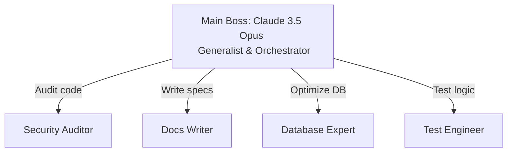

# Subagents as Specialists

## Summary
แทนที่จะพึ่งพา AI ตัวเดียวให้เป็นเป็ดที่ทำได้ทุกอย่าง (Jack-of-all-trades) การใช้ [[Claude Subagent|Subagent]] จะช่วยให้คุณสามารถสร้างทีม "ผู้เชี่ยวชาญเฉพาะทาง (Specialists)" ที่ทำงานร่วมกับ Main Session (ที่รับบทเป็นหัวหน้า) ได้อย่างมีประสิทธิภาพ

## Core Content
- **รูปแบบการทำงาน (Smart Boss & Expert Team):**
  - Main Session มักจะเป็นโมเดลที่ฉลาดที่สุดและมองภาพรวมได้ดีที่สุด
  - แทนที่จะให้ Main Session ทำเองหมด มันสามารถแจกจ่ายงานเฉพาะด้านให้ Subagents ที่ถูกปรับแต่ง Prompt หรือกำหนดเครื่องมือมาให้เก่งเฉพาะเรื่องนั้นๆ
  - ตัวอย่างของ Specialists: Security Auditor, Database Architect, Documentation Writer, Test Engineer 
- **การยืมความเชี่ยวชาญ (Borrowing Expertise):**
  - คุณไม่จำเป็นต้องสร้าง Subagent เองเสมอไป สามารถใช้ [[Creating Custom Subagents|Custom subagents]] ที่ถูกสร้างขึ้นจากผู้เชี่ยวชาญคนอื่น (เช่น จาก GitHub Repo: `awesome-claude-code-subagents`) 
  - คำเตือน: หากดาวน์โหลด Subagent จาก Open Source ควรตรวจสอบ Prompt Injection หรือให้ตั้งค่าเป็น [[Read-Only Subagents and Cost Efficiency|Read-Only]] ก่อนเสมอเพื่อความปลอดภัย

## Content Visualization

### Organization Structure Diagram

## Related
- [[Claude Subagent]]
- [[Creating Custom Subagents]]
- [[Read-Only Subagents and Cost Efficiency]]

## Sources
- [[How to Build Claude Subagents Better Than 99% of People]]
