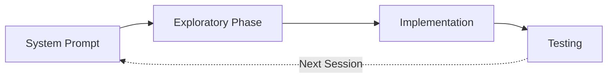

# Phase 1: Research & Prototyping

## Definition
Phase 1 ของ AI Coding Workflow มุ่งเน้นไปที่การสำรวจและจัดเตรียมบริบท (Context) ให้เหมาะสม โดยหัวใจสำคัญคือการซอยงานใหญ่ให้เล็กลงเพื่อให้ LLM ทำงานอยู่ใน "Smart Zone" เสมอ และป้องกันไม่ให้เข้าสู่ "Dumb Zone" เมื่อ Context ใหญ่เกินไป

## How It Works
กลไกหลักของการ Research & Prototyping ประกอบด้วยการบริหารจัดการ Context และ Task:

1. **Smart Zone vs Dumb Zone**: เมื่อเราป้อนข้อมูลลงใน Context Window มากเกินไป LLM จะเริ่มตัดสินใจแย่ลง (Dumb Zone) การทำงานจึงต้องแบ่งงานให้เล็กพอที่จะอยู่ใน Smart Zone เสมอ
2. **Multi-Phase Plan Loop**: แทนที่จะสั่งงานรวดเดียวจบ ให้แบ่งกระบวนการเป็น Phase เล็กๆ (เช่น Phase 1, Phase 2 ... Phase N) และทำลูปซ้ำๆ เพื่อให้แต่ละรอบมีความซับซ้อนน้อยที่สุด
3. **The Memento Effect**: LLM ไม่มีสถานะ (Stateless) เหมือนตัวเอกในหนังเรื่อง Memento ทุกครั้งที่ล้าง Context (Clear Context) มันจะกลับไปเริ่มใหม่ที่ System Prompt การควบคุมให้ LLM เริ่มใหม่หมดมักจะให้ผลลัพธ์ที่คาดเดาได้ดีกว่าการพยายามบีบอัดประวัติการสนทนา (Compacting)
4. **Session Cycle**: ทุก Session ของ LLM มักจะมีวงจรคือ: `System Prompt -> Exploratory Phase (ค้นหาโค้ด) -> Implementation -> Testing`

## Why It Matters
การจัดการใน Phase นี้นับว่าสำคัญมาก เพราะหากไม่แบ่งงานหรือจัดการ Context ให้ดี LLM จะใช้ Token มหาศาลไปกับการทำความเข้าใจบริบทที่ล้นเกิน และให้ผลลัพธ์ที่ผิดพลาด การเริ่มต้นด้วยโครงสร้างการจัดการ Context ที่ดีจึงเป็นรากฐานสู่ความสำเร็จในการใช้ AI ช่วยเขียนโค้ด

## Examples
- การจัดการฟีเจอร์ใหญ่ๆ ด้วยการซอยย่อยเป็น Issue เล็กๆ แล้วให้ AI แก้ทีละ Issue (Phase loop)
- การคอยตรวจสอบและจับตาดูปริมาณ Token ที่ใช้งานอยู่เสมอ เพื่อให้รู้ว่าใกล้ทะลุออกจาก Smart Zone หรือยัง

## Connections
- [[smart_zone|Smart Zone]]
- [[dumb_zone|Dumb Zone]]
- [[the_memento_effect|The Memento Effect]]
- [[context_compacting|Context Compacting]]
- [[matt_pocock_ai_workflow_summary]]

## Sources
- [[matt_pocock_ai_workflow_summary|Full Walkthrough Workflow for AI Coding — Matt Pocock]]
