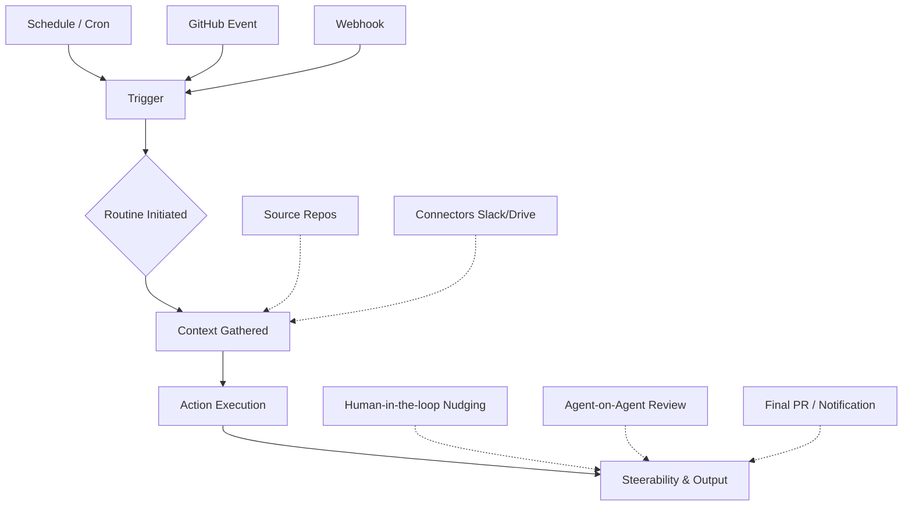

# Claude Code Routines

## Summary
Claude Code Routines เป็นฟีเจอร์ใหม่ที่ถูกออกแบบมาเพื่อเปลี่ยน Claude Code จากเพียงแค่เครื่องมือ (tool) ที่ต้องรอรับคำสั่ง ให้กลายเป็นเพื่อนร่วมทีม (teammate) ที่สามารถทำงานเชิงรุก (proactive) ได้อย่างอัตโนมัติ โดยระบบจะรันอยู่บน infrastructure ที่จัดการโดย Claude Code โดยตรง

ผู้ใช้งานสามารถตั้งค่า Routines ได้อย่างง่ายดายผ่านคำสั่ง `/schedule` โดยกำหนดเพียงแค่ prompt, repository ที่เกี่ยวข้อง, connectors (เช่น Slack, Google Drive) และ triggers (เวลาหรือเหตุการณ์) ระบบจะจัดการเรื่อง hosting, session state, และ authentication ให้ทั้งหมด ช่วยลดภาระของนักพัฒนาที่ต้องมานั่งสร้างและดูแลระบบ infrastructure สำหรับรัน agent ด้วยตนเอง

## Core Content
Routines ช่วยให้ Claude Code สามารถดำเนินการคำสั่งแบบ proactive โดยอัตโนมัติ โดยที่ผู้ใช้ไม่ต้องคอยกดสั่งการเอง (manually initiate sessions) หรือเปิดเครื่องคอมพิวเตอร์ทิ้งไว้ ซึ่งช่วยแก้ปัญหาคลาสสิกของนักพัฒนาที่ต้องมานั่งสร้างและดูแล infrastructure สำหรับ autonomous agents เอง

### Key Benefits (ข้อดีหลัก)
- **Always Available (พร้อมใช้งานเสมอ)**: รันอยู่บน managed cloud infrastructure ของ Claude Code หมดปัญหาเรื่องต้องเปิดแล็ปท็อปทิ้งไว้
- **Zero Infrastructure Maintenance (ไม่ต้องดูแลระบบพื้นฐาน)**: ตัดปัญหาที่ต้องมาสร้าง custom infrastructure สำหรับการทำ hosting, การจัดการ data persistence, หรือระบบ authentication
- **Interactive and Steerable (โต้ตอบและควบคุมทิศทางได้)**: แตกต่างจาก headless agents ทั่วไป เซสชันของ Routine สามารถเข้าไปดู, กดหยุด (pause), สั่งการหรือชี้แนะแนวทาง (steer), และรันต่อ (resume) ได้แบบเรียลไทม์ผ่าน web interface, CLI หรือแอปพลิเคชันบน Desktop

### Setting Up a Routine (การตั้งค่า Routine)
การตั้งค่า routine ประกอบด้วยโครงสร้างหลัก 3 อย่าง ได้แก่:

1. **Triggers (ตั้งให้รันเมื่อไหร่)**
   - *Time-based (ตั้งตามเวลา/Schedule)*: รันตามรอบหรือ cron ที่กำหนด (เช่น "ทุกวันจันทร์ 10 โมงเช้า")
   - *Event-based (ตั้งตามเหตุการณ์)*: ถูก trigger ด้วย GitHub events แบบ native (เช่น มีการเปิด issue ใหม่, มีการ merge PR) หรือสั่งการผ่าน custom post requests ไปยัง webhooks
2. **Context (ข้อมูลบริบทที่ Agent ควรรู้)**
   - *Repositories*: การเข้าถึง codebase หนึ่งหรือหลายอัน (เช่น source code หลัก และ documentation repo)
   - *Connectors*: การเชื่อมต่อระบบกับเครื่องมืออื่นๆ เช่น Google Drive (สำหรับดึงข้อมูลบรีฟ), Slack (สำหรับการแจ้งเตือน), หรือ monitoring tools ต่างๆ เช่น DataDog หรือ Grafana
3. **Steerability (วิธีควบคุมคุณภาพ)**
   - *Agent-on-agent review*: การใช้แพตเทิร์น generator-critiquer โดยให้ routine ตัวหนึ่งไปตรวจผลงานของอีกตัวหนึ่ง (เช่น การไปคอมเมนต์ใน PR)
   - *Human-in-the-loop*: การเข้าไปมอนิเตอร์ดูแบบสดๆ และคอยปรับแนวทาง (nudging) แบบเรียลไทม์ผ่าน Claude web interface
   - *Output verification*: ตรวจสอบและดูผลลัพธ์ด้วยคนให้แน่ใจก่อนทำการขั้นสุดท้าย (เช่น เข้าไปหน้า doc site เพื่อความมั่นใจก่อนกด merge)

### Routine Workflow Visualization

### Use Cases (ตัวอย่างการนำไปใช้งาน)
| Use Case (กรณีการใช้งาน) | Trigger (ตัวจุดชนวน) | Context Required (บริบทที่จำเป็น) | Outcome (ผลลัพธ์) |
| :--- | :--- | :--- | :--- |
| **Automated Docs Creation** | ตั้งเวลาแบบ Schedule (รายสัปดาห์) หรือแบบ Event-based (ดู GitHub issue ที่ติดป้าย "need docs") | Source Code Repo, Docs Repo | วิเคราะห์ PR หรือ issue ที่ถูก merge, เทียบส่วนที่ต่างกับ Docs ปัจจุบัน และเปิด PR ใหม่เพื่ออัปเดตใน Docs repo |
| **Deploy Verifier** | Webhook จาก CD pipeline หลังการ deployment | Source Code, Monitoring tools (DataDog/Grafana), Slack | ตรวจสอบ health ของเซอร์วิสหลังดีพลอย สามารถแจ้งเตือนผ่าน Slack และสามารถตั้งให้ roll back ให้อัตโนมัติหากพบปัญหา |
| **On-call Investigator** | (ไม่ได้ระบุรายละเอียดในต้นฉบับ) | (ไม่ได้ระบุรายละเอียดในต้นฉบับ) | ใช้เป็นตัวช่วยสืบสวนปัญหาเบื้องต้น (กล่าวถึงเป็นเพียงไอเดีย) |
| **PM Backlog Manager** | ตั้งเวลาแบบ Schedule (รายสัปดาห์) | GitHub Issues, Slack channels | อ่านตรวจสอบ backlog issues และคำขอใน Slack, ช่วยจัดลำดับความสำคัญ (prioritize), และดราฟต์ PR เริ่มต้นให้ |

## Related
- [[proactive-agent|Proactive Agents]]

## Sources
- [[Build a proactive agent workflow with Claude Code]]

## Questions to follow up
- custom events รูปแบบไหนบ้างที่รองรับการทำ webhooks เพื่อใช้สั่ง trigger routines?
- การจัดการ state persistence ของ routines ผ่าน connectors ต่างชนิดกัน มีการทำงานอย่างไร?
- มีการจำกัดปริมาณ compute/token usage หรือไม่ สำหรับ routines ที่รันนานมากๆ (long-running)?
