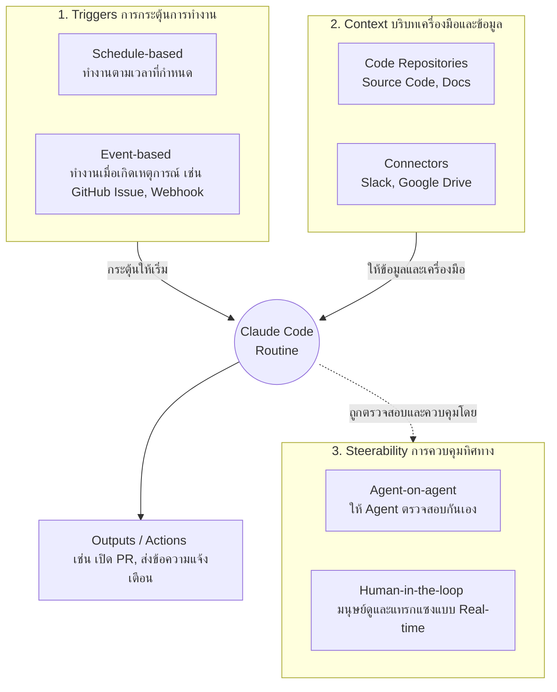

# Claude Code Routines

## Summary
Claude Code Routines คือฟีเจอร์ที่เปลี่ยน Claude Code จากเพียงเครื่องมือ (Tool) ให้กลายเป็นเพื่อนร่วมทีมเชิงรุก (Proactive teammate) โดยสามารถทำงานได้อัตโนมัติตามเงื่อนไขที่กำหนดไว้โดยไม่ต้องรอให้ผู้ใช้กดเริ่มทำงาน ช่วยขจัดความยุ่งยากในการสร้างและดูแลโครงสร้างพื้นฐาน (Infrastructure) เช่น การทำ Hosting, Cron jobs หรือ Authentication ด้วยตนเอง การทำงานจะรันอยู่บน Infrastructure ของ Anthropic แทนที่จะเป็นเครื่องของผู้ใช้

## Core Principles
การทำงานของ Routines ประกอบด้วยหลักการสำคัญ 3 ประการ ได้แก่ Triggers, Context และ Steerability

### 1. Triggers (เงื่อนไขการเริ่มต้นทำงาน)
เป็นตัวกำหนดว่า Routine จะเริ่มทำงานเมื่อใด แบ่งออกเป็น 2 รูปแบบหลัก:
- **Schedule-based**: การตั้งเวลาการทำงานเป็นรอบ (เช่น การตรวจสอบและอัปเดตเอกสารทุกสัปดาห์) โดยสามารถสั่งผ่านคำสั่ง `/schedule` ภายใน Claude Code ได้ทันที
- **Event-based**: การทำงานเมื่อมีเหตุการณ์เกิดขึ้น รองรับเหตุการณ์จากระบบ เช่น Native GitHub events (เช่น เมื่อมีการเปิด Issue ใหม่) หรือสามารถตั้งค่าผ่าน Custom Webhook เพื่อส่งมอบข้อมูล Payload มาให้เริ่มทำงานได้ (เช่น เริ่มทำงานทุกครั้งที่มีการ Deploy)

### 2. Context (บริบทและข้อมูล)
ข้อมูลและเครื่องมือที่ Agent จำเป็นต้องมีเพื่อให้ทำงานได้สำเร็จ ซึ่งสิ่งเหล่านี้จะเป็นตัวกำหนดขีดจำกัดประสิทธิภาพของตัว Agent ประกอบด้วย:
- **Repositories**: สิทธิ์การเข้าถึง Source Code Repo หรือ Documentation Repo เพื่อให้ Agent สามารถอ่านและเขียนโค้ดได้
- **Additional Context**: ข้อมูลบริบทเพิ่มเติมจากแหล่งอื่นๆ เช่น เอกสารและคู่มือใน Google Drive
- **Tools/Connectors**: การเชื่อมต่อเครื่องมือภายนอกเพื่อการปฏิบัติงาน (เช่น การส่งการแจ้งเตือนบน Slack หรือการดึงข้อมูลจาก Monitoring Tools เช่น Datadog, Grafana)

### 3. Steerability (การควบคุมทิศทางและการตรวจสอบ)
แม้ Routine จะทำงานอัตโนมัติ การควบคุมและรักษาคุณภาพผลลัพธ์ยังคงจำเป็น สามารถทำได้ผ่านวิธีการต่างๆ:
- **Agent-on-agent review**: การใช้หลักการแบบ Generator-Critiquer คือให้ Routine หนึ่งทำหน้าที่สร้างผลลัพธ์ เช่น เปิด PR และใช้อีก Routine หนึ่งเพื่อทำหน้าที่วิจารณ์และตรวจสอบ PR นั้น
- **Interactive Monitoring**: สามารถติดตามการทำงานของ Session ได้แบบ Real-time ผ่าน Web interface ของ Claude.ai เพื่อดูสิ่งที่ Agent กำลังประมวลผลอยู่ สามารถสอบถาม แทรกแซง (Nudge) หรือแม้กระทั่งสั่งหยุด/ดำเนินการต่อ (Resume) ได้
- **Output Verification**: การตรวจสอบผลลัพธ์ให้แน่ใจว่าถูกต้องตามที่ต้องการก่อนที่จะยอมรับให้ใช้งานจริง

## Related
- [[source_build_a_proactive_agent_workflow_with_claude_code]]
- [[claude_prompt_caching]]
- [[claude_subagent]]
- [[dynamic_workflow]]
- [[orchestration]]
- [[progressive_disclosure]]
- [[session_handoff]]
- [[token_dashboard]]
- [[claude_code]]
- [[nate_herk]]
- [[claude_code_routines_summary]]
- [[claude_prompt_caching_summary]]
- [[claude_subagents_summary]]

## Questions to follow up
- What are the cost implications or token limits associated with running long or frequent automated workflows (Routines) on Claude Code?
