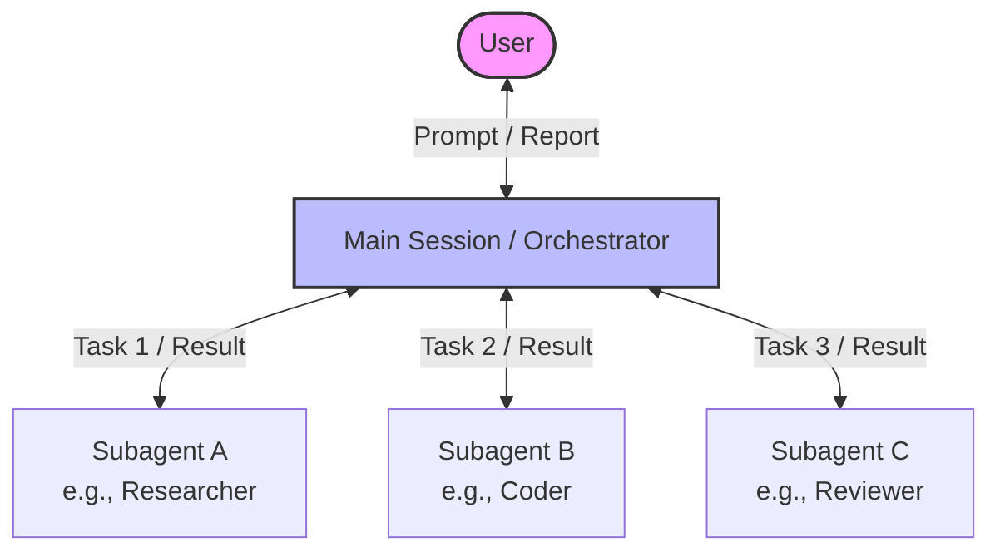

# Claude Subagent

## Definition
Claude Subagent คืออินสแตนซ์ (Instance) ย่อยของโมเดลภาษา (LLM) ใน Claude Code ที่ทำงานเฉพาะทางตามที่ได้รับมอบหมายจาก Main Agent (เซสชันหลักที่ผู้ใช้สื่อสารด้วย) โดย Subagent แต่ละตัวจะมี Context Window หรือหน่วยความจำที่แยกเป็นอิสระและสดใหม่เสมอ ทำให้สามารถประมวลผลงานขนาดใหญ่ได้โดยไม่ทำให้ Context ของ Main Agent รกไปด้วยข้อมูลที่ไม่จำเป็น นอกจากนี้ยังสามารถทำงานคู่ขนานกันได้ (Parallel execution) และเลือกใช้โมเดลที่เล็กลง (เช่น Haiku) เพื่อประหยัดค่าใช้จ่ายได้อีกด้วย

## How It Works

### โครงสร้างและหลักการทำงาน
Main Agent ทำหน้าที่เป็นผู้ควบคุม (Orchestrator) ที่คอยจ่ายงานให้กับ Subagents โดย Subagents จะไม่สามารถสื่อสารกันเองได้โดยตรง (ทำงานแบบ 1-to-1 กับ Main Agent) หลังทำงานเสร็จ Subagent จะส่งผลลัพธ์กลับไปยัง Main Agent เพื่อรายงานให้ผู้ใช้ทราบ

### ความแตกต่างระหว่าง Subagents และ Skills

| คุณสมบัติ | Subagent | Skill |
| --- | --- | --- |
| **Context Window** | แยกเป็นอิสระ (Clean context) | ทำงานใน Context หลักร่วมกับ Main Agent |
| **การทำงาน** | สามารถทำงานคู่ขนาน (Parallel) ได้หลายตัว | มักเรียกใช้งานตามลำดับใน Main Session |
| **โมเดลที่ใช้** | กำหนดโมเดลเฉพาะได้ (เช่น ใช้ Haiku แทน Opus) | ใช้โมเดลเดียวกับ Main Agent |
| **การนำไปใช้** | งานที่กิน Token สูง, ค้นคว้าข้อมูลจำนวนมาก | เวิร์กโฟลว์เฉพาะเจาะจงที่ใช้บ่อยๆ (เช่น โพสต์ LinkedIn) |

*หมายเหตุ:* ทั้ง Subagents และ Skills ถูกสร้างด้วยไฟล์ `.md` (Markdown) พร้อม YAML Frontmatter เหมือนกัน และทำงานร่วมกันได้ (Skill สามารถเรียกใช้ Subagent ได้)

### การสร้างและการตั้งค่า (Best Practices)
1. **Progressive Disclosure**: Claude Code ใช้ฟีเจอร์นี้ในการค้นหาว่าควรเรียกใช้ Agent หรือ Skill ใด ดังนั้นส่วน `description` ใน YAML Frontmatter ต้องมีความชัดเจนและเฉพาะเจาะจงมาก เพื่อป้องกันการถูกเรียกใช้ผิดเวลา (Misfires)
2. **การกำหนดสิทธิ์ (Tool Restrictions)**: ควรกำหนด `tools` ให้อย่างรัดกุม เช่น หากต้องการให้ค้นหาหรืออ่านข้อมูลอย่างเดียว ควรกำหนดให้เป็น `read-only` เพื่อความปลอดภัย
3. **การประหยัดค่าใช้จ่าย**: ใช้โมเดลขนาดเล็ก (เช่น Haiku) สำหรับงานอ่านหรือสรุปข้อมูลจำนวนมาก (เช่น สรุปไฟล์ 300 หน้า) และใช้โมเดลฉลาด (เช่น Opus) เป็น Orchestrator หลัก
4. **Project vs Global**: Subagents สามารถบันทึกไว้ในระดับ Project (อยู่ในโฟลเดอร์ `.claude/agents/` ของโปรเจกต์) หรือในระดับ Global เพื่อให้เรียกใช้ได้ทุกโปรเจกต์

### เมื่อใดควรใช้ (When to use)
- เมื่อต้องอ่านไฟล์จำนวนมาก หรือข้อมูลที่อ่านแล้วไม่ต้องเก็บไว้ใน Main Context
- เมื่อมีการสร้าง Output ยาวๆ (Wall of output)
- งานอิสระที่สามารถรันแบบขนานได้ (เช่น ตรวจสอบหนังสือ 15 บทพร้อมกัน)
- เมื่อต้องการผู้ตรวจทานแบบไม่มีอคติ (Unbiased Reviewer) โดยไม่ต้องสนใจ Context เดิม

### เมื่อใดไม่ควรใช้ (When not to use)
- งานแก้ไขอย่างรวดเร็ว (Quick edits)
- งานที่ต้องทำตามลำดับขั้นตอนต่อเนื่อง (Sequential steps) เนื่องจาก Subagents ไม่สามารถส่งต่องานหรือคุยกันเองได้
- งานที่ต้องอาศัยบริบทการสนทนาทั้งหมดที่ผ่านมา

## Connections
- [[how_to_build_claude_subagents|How to Build Claude Subagents Better Than 99% of People]]
- [[how_to_build_claude_subagents]]
