# Show Yourself & Transition Curve

## Summary
แนวคิด "Show Yourself" (หรือการสร้างผลงานให้โลกเห็น / Build in Public) คือการกล้าเปิดเผยตัวเองและกระบวนการเรียนรู้หรือการทำงานออกสู่สาธารณะ ไม่ว่าผลงานนั้นจะสมบูรณ์แบบหรือไม่ก็ตาม เพื่อสร้างตัวตนและหลักฐานเชิงประจักษ์ (Proof of Work) ในขณะเดียวกัน การเริ่มต้นทำสิ่งใหม่มักต้องเผชิญกับ "Transition Curve" (เส้นโค้งการเปลี่ยนผ่าน) ที่เริ่มจากความมองโลกในแง่ดีเพราะไม่รู้ความจริง ไปสู่ความท้อแท้เมื่อพบอุปสรรค และกลับมามองโลกในแง่ดีอีกครั้งเมื่อมีความรู้ความเข้าใจอย่างแท้จริง

## Core Principles

### 1. Show Yourself (Build in Public)
แนวคิดนี้ได้แรงบันดาลใจจาก Alex Hormozi หลักการสำคัญคือ "ถ้าคุณอยากเป็นใครสักคนหรือทำสิ่งที่ยิ่งใหญ่ ก้าวแรกคือคุณต้องแสดงตัวตนออกมา"
- **ไม่ต้องรอให้สมบูรณ์แบบ:** แค่เริ่มต้นทำและนำเสนอออกมา
- **สร้างหลักฐานเชิงประจักษ์ (Proof of Work):** การทำเนื้อหา เช่น วิดีโอ บทความ หรือโพสต์บนโซเชียลมีเดีย เป็นการสร้างพอร์ตโฟลิโอที่มีชีวิต เมื่อถึงเวลาที่ต้องสัมภาษณ์งานหรือนำเสนอผลงาน คุณจะสามารถตอบคำถามที่ว่า "คุณเคยสร้างอะไรมาบ้าง?" (What have you built?) ได้อย่างเป็นรูปธรรม
- **การผลักดันตัวเองออกจากจุดที่สบายใจ (Comfort Zone):** เช่น การรับหน้าที่เป็นผู้บรรยาย หรือการสร้างช่อง YouTube แม้จะไม่มีผู้ติดตามก็ตาม

### 2. Transition Curve (เส้นโค้งการเปลี่ยนผ่าน)
กระบวนการทางอารมณ์และจิตใจเมื่อเริ่มต้นทำสิ่งใหม่หรือเผชิญกับความท้าทาย ซึ่งมี 3 ระยะหลัก:

```mermaid
flowchart LR
    A[Uninformed Optimist<br/>มองโลกแง่ดีเพราะยังไม่รู้] --> B[Informed Pessimist<br/>มองโลกแง่ร้ายเมื่อรู้ความจริง]
    B --> C{Decision Point<br/>จุดตัดสินใจ}
    C -->|Crash and Burn<br/>ยอมแพ้| D[Failure<br/>ล้มเหลว]
    C -->|Push Through<br/>ผลักดันต่อไป| E[Informed Optimist<br/>มองโลกแง่ดีบนพื้นฐานความจริง]
    
    classDef default fill:#000,stroke:#333,stroke-width:2px;
    classDef critical fill:#000,stroke:#ff0000,stroke-width:2px;
    class C critical;
```

1. **Uninformed Optimist (มองโลกในแง่ดีเพราะยังไม่รู้):** ช่วงเริ่มต้นที่เต็มไปด้วยความตื่นเต้นและแรงบันดาลใจ เพราะยังไม่เข้าใจถึงความซับซ้อนและอุปสรรคที่แท้จริง
2. **Informed Pessimist (มองโลกในแง่ร้ายเมื่อรู้ความจริง):** ช่วงที่เริ่มลงมือทำแล้วพบกับปัญหา ความยากลำบาก และความซับซ้อน ทำให้เกิดความรู้สึกท้อแท้และหนักใจ (Overwhelm) จุดนี้เป็นจุดตัดสินใจสำคัญว่าจะ "ยอมแพ้" (Crash and burn) หรือ "เดินหน้าต่อ" (Push through)
3. **Informed Optimist (มองโลกในแง่ดีอย่างผู้รู้จริง):** หากผ่านจุดที่ท้อแท้มาได้ จะก้าวเข้าสู่สถานะที่กลับมามองโลกในแง่ดีอีกครั้ง แต่คราวนี้เป็นความมั่นใจที่ตั้งอยู่บนพื้นฐานของความรู้ ประสบการณ์ และความเข้าใจอย่างแท้จริง

## Related
- [[entity_ailin]]
