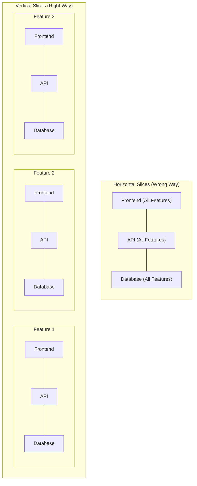

# Slicing Work into Issues

## Definition
การนำ PRD (Product Requirement Document) หรือเป้าหมายของโปรเจกต์มาแตกย่อยเป็นงานชิ้นเล็กๆ (Issue หรือ Ticket) ในรูปแบบกระดาน Kanban เพื่อกำหนดความสัมพันธ์ของการบล็อกงาน (Blocking relationships) และช่วยให้ AI สามารถทำงานเป็นสัดส่วนได้อย่างมีประสิทธิภาพ

## How It Works
กระบวนการซอยงานที่ดีจะใช้แนวคิดของการสร้าง **"Vertical Slices"** (หรือเรียกว่า Traceable Bullets) แทนการสร้างแบบ **"Horizontal Slices"**
- **Horizontal Slices (สิ่งที่ AI ชอบทำแต่ไม่ดี):** การเขียนโค้ดไปทีละเลเยอร์ เช่น สร้างส่วน Database ของทุกฟีเจอร์ก่อน แล้วค่อยทำ API จากนั้นค่อยทำ Frontend 
- **Vertical Slices (สิ่งที่ควรทำ):** การตัดฟีเจอร์เป็นชิ้นในแนวตั้งให้ครอบคลุมทุกเลเยอร์ของระบบใน Issue เดียว เช่น ในหนึ่ง Issue ควรมีการปรับ Schema, การสร้าง Service, และการมีหน้า UI เบื้องต้นเพื่อแสดงผล

## Why It Matters
- **ความเร็วในการรับ Feedback:** หากทำงานแบบ Horizontal เราจะไม่สามารถทดสอบระบบรวมจนกว่าการพัฒนาในเลเยอร์สุดท้าย (เช่น Frontend) จะเสร็จสิ้น ในทางกลับกัน Vertical Slices ทำให้ได้ระบบที่ทำงานร่วมกันได้และสามารถทดสอบได้ทันทีตั้งแต่ Issue แรกจบ
- **แก้ปัญหา AI ทำงานแบบไร้ทิศทาง:** การให้ AI เขียนโค้ดแบบทีละเลเยอร์เปรียบเสมือนการยิงปืนในที่มืดโดยไม่เห็นเป้า (Traceable Bullets) การซอยงานแบบ Vertical Slices จะบังคับให้ AI เห็นผลลัพธ์ของสิ่งที่ตัวเองสร้างในทุกๆ การพัฒนา

## Examples
- แทนที่จะแบ่งงานเป็น "สร้าง Database Schema สำหรับ Gamification" (Horizontal) ให้เปลี่ยนเป็นงาน "สร้างฟีเจอร์ Gamification พื้นฐานที่ประกอบด้วย Schema, Service และหน้า UI เบื้องต้น" (Vertical)

## Sources
- [[matt_pocock_ai_workflow_summary|Full Walkthrough Workflow for AI Coding — Matt Pocock]]
