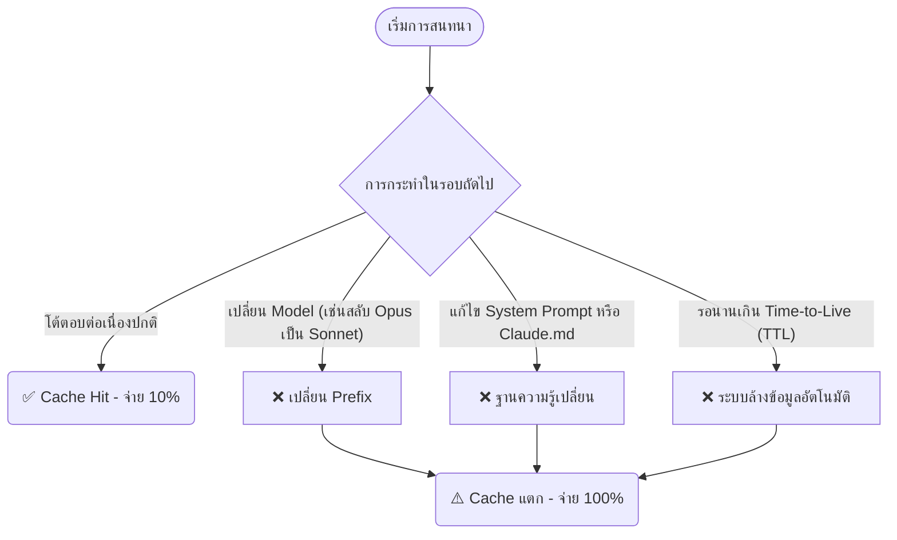

# Token Optimization & Cache Management

## Summary
การบริหารจัดการ Token อย่างมีประสิทธิภาพ ไม่ได้ขึ้นอยู่กับการพยายามเขียนคำสั่งให้สั้นที่สุดเท่านั้น แต่หัวใจสำคัญคือการ "รักษา Cache" ให้อยู่รอด (High Cache Hit Rate) เพื่อดึงข้อมูลเดิมกลับมาใช้ในราคา 10% การสร้างนิสัยการใช้งานที่ถูกต้องและการรู้ว่าพฤติกรรมใดจะไปทำลาย Cache จะช่วยประหยัดงบประมาณและเวลาได้มหาศาล

## Core Content

### 3 นิสัยเพื่อรักษา Cache ให้คงอยู่ (Best Practices)
เพื่อให้ระบบเรียกใช้ `Cache Read` อย่างต่อเนื่อง ควรปฏิบัติตามแนวทางดังนี้:
1. **อย่าปล่อยค้างไว้นานเกินไป (Don't Pause Too Long):** หากรู้ว่าต้องพักหน้าจอนานเกินกว่าเวลา TTL (เช่น ไปพักกินข้าว 1-2 ชั่วโมง) ไม่ควรคาดหวังว่ากลับมาแล้วจะได้ใช้ Cache เดิม ให้ใช้ระบบ Session Handoff แทน
2. **เริ่มต้นใหม่เมื่อเปลี่ยนงาน (Start Fresh):** เมื่อเสร็จจากงานเขียนระบบหลังบ้าน และกำลังจะเริ่มวิเคราะห์ข้อมูล ให้ **เคลียร์ Session เสมอ** (เช่นใช้คำสั่ง `/clear` หรือสร้างห้องแชทใหม่) เพื่อไม่ให้เปลือง Token ไปกับการประมวลผลประวัติเก่าที่ไม่เกี่ยวกับงานใหม่
3. **ใช้ระบบ Session Handoff:** แทนที่จะปล่อยให้ Session โตขึ้นเรื่อยๆ จนบวม ให้สั่ง AI ทำการสรุป (Summarize) สิ่งที่ทำไปแล้ว ไฟล์ที่แก้ไข และเป้าหมายถัดไป จากนั้นคัดลอกสรุปนั้นไปเริ่มคุยในหน้าต่างใหม่ (Session ใหม่) 

### สิ่งที่ทำให้ Cache แตก (Cache Invalidation)
สถานการณ์ต่อไปนี้จะทำให้ Cache ที่สะสมมาถูกล้างทิ้งทันที ส่งผลให้ระบบต้องนับหนึ่งใหม่และคิดราคาแบบ **Cache Create เต็ม 100%**:

**คำอธิบายเพิ่มเติม:**
- **เปลี่ยน Model ระหว่างทาง:** Cache ผูกติดอยู่กับโครงสร้างของแต่ละโมเดล (Prefix Matching) การใช้คำสั่งสลับโมเดลระหว่างทำงานจะรีเซ็ต Cache ทันที แม้แต่คำสั่งอย่าง `Opus for plan, Sonnet for execution` ก็มีจังหวะที่รีเซ็ต Cache ไปมา
- **แก้ System Prompt กลางคัน:** หากแก้ไฟล์อย่าง `Claude.md` (สำหรับ Claude Code) ระบบจะยังไม่สนใจจนกว่าจะเปิด Session ใหม่ ซึ่งตอนนั้นก็จะต้องโหลด Cache ใหม่ทั้งหมด
- **ปล่อยเกินเวลา:** สำหรับ API จะหมดอายุใน 5 นาที ส่วนแอปปกติหรือเว็บหมดอายุใน 1 ชั่วโมง

## Related
- [[Prompt Caching]]

## Sources
- [[Give Me 10 Mins and I'll Save You Millions of Claude Tokens]]
